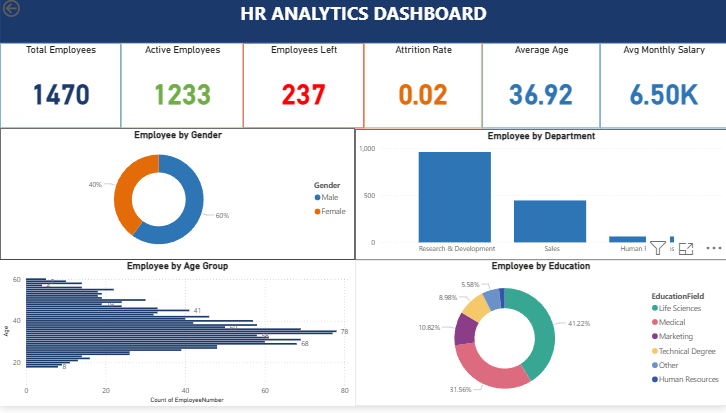
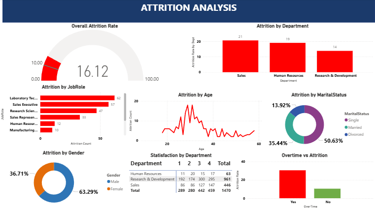
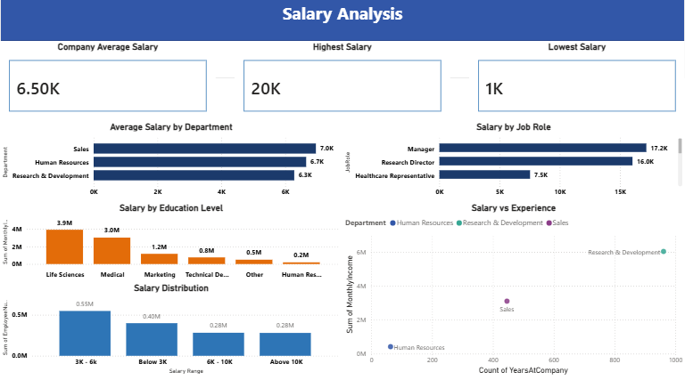
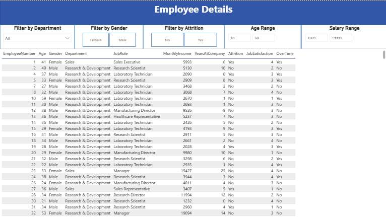

# HR-Analytics-Dashboard
HR Analytics Dashboard using SQL and Power BI
# 📊 HR Analytics Dashboard


---

## 📌 Project Overview

This project presents a comprehensive HR 
Analytics Dashboard built using SQL and 
Power BI. The dashboard analyzes employee 
data from IBM HR Analytics dataset 
containing 1470 employee records to 
uncover key insights about attrition, 
salary distribution, department 
performance, and employee demographics.

The goal of this project is to help HR 
teams and business leaders make data 
driven decisions to improve employee 
retention and overall organizational 
performance.

---

## 🎯 Problem Statement

Organizations often struggle with 
high employee attrition which leads to:
- Increased hiring and training costs
- Loss of institutional knowledge
- Decreased team productivity
- Poor employee morale

This dashboard answers critical questions:
- What is the overall attrition rate?
- Which departments have highest attrition?
- Which job roles are most at risk?
- How does salary affect attrition?
- What role does overtime play in attrition?
- How does marital status affect retention?

---

## 🛠️ Tools and Technologies Used

| Tool | Purpose |
|------|---------|
| SQL | Data exploration and analysis |
| Power BI Desktop | Dashboard creation |
| Microsoft Excel | Data preparation |
| DAX | Calculated measures and KPIs |
| GitHub | Version control and hosting |

---

## 📁 Dataset Information

| Detail | Information |
|--------|------------|
| Source | IBM HR Analytics |
| Platform | Kaggle.com |
| Total Records | 1470 employees |
| Total Columns | 35 attributes |
| File Format | CSV |

### Key Columns Used:
- EmployeeID
- Age
- Gender
- Department
- JobRole
- MonthlyIncome
- YearsAtCompany
- Attrition
- JobSatisfaction
- WorkLifeBalance
- PerformanceRating
- Education
- MaritalStatus
- OverTime
- EducationField

---

## 📂 Project Structure

HR-Analytics-Dashboard/
│
├── 📁 Data/
│   └── hr_data.csv
│
├── 📁 SQL/
│   ├── 01_data_exploration.sql
│   ├── 02_attrition_analysis.sql
│   ├── 03_salary_analysis.sql
│   └── 04_department_analysis.sql
│
├── 📁 PowerBI/
│   └── hr_dashboard.pbix
│
├── 📁 Screenshots/
│   ├── overview_page.png
│   ├── attrition_page.png
│   ├── salary_page.png
│   └── employee_details_page.png
│
└── 📄 README.md

---

## 📊 Dashboard Pages

### Page 1 — HR Overview
Complete company wide summary showing:
- Total employees count
- Active employees count
- Overall attrition count
- Attrition rate percentage
- Average employee age
- Average monthly salary
- Gender distribution donut chart
- Department wise headcount column chart
- Age group bar chart
- Education field donut chart

### Page 2 — Attrition Analysis
Deep dive into attrition patterns showing:
- Overall attrition rate gauge
- Attrition by department column chart
- Attrition by job role bar chart
- Attrition by age group line chart
- Attrition by gender donut chart
- Overtime impact on attrition chart
- Job satisfaction matrix by department
- Attrition by marital status donut chart

### Page 3 — Salary Analysis
Complete salary breakdown showing:
- Company average salary card
- Highest salary card
- Lowest salary card
- Average salary by department bar chart
- Salary by job role bar chart
- Salary by education level column chart
- Salary vs experience scatter chart
- Salary range distribution column chart

### Page 4 — Employee Details
Interactive employee data table with:
- Department slicer filter
- Gender slicer filter
- Attrition slicer filter
- Age range slider
- Salary range slider
- Complete employee details table
- Dynamic KPI cards that update with filters

---

## 📈 DAX Measures Used

```dax
-- Total Employees
Total Employees = 
COUNT(hr_data[EmployeeID])

-- Active Employees
Active Employees = 
CALCULATE(
    COUNT(hr_data[EmployeeID]),
    hr_data[Attrition] = "No"
)

-- Attrition Count
Attrition Count = 
CALCULATE(
    COUNT(hr_data[EmployeeID]),
    hr_data[Attrition] = "Yes"
)

-- Attrition Rate
Attrition Rate = 
DIVIDE(
    [Attrition Count],
    [Total Employees],
    0
) * 100

-- Average Salary
Avg Salary = 
AVERAGE(hr_data[MonthlyIncome])

-- Maximum Salary
Max Salary = 
MAX(hr_data[MonthlyIncome])

-- Minimum Salary
Min Salary = 
MIN(hr_data[MonthlyIncome])

-- Average Age
Avg Age = 
AVERAGE(hr_data[Age])

-- Department Attrition Rate
Dept Attrition Rate = 
DIVIDE(
    CALCULATE(
        COUNT(hr_data[EmployeeID]),
        hr_data[Attrition] = "Yes"
    ),
    COUNT(hr_data[EmployeeID]),
    0
) * 100

-- Age Group Column
Age Group = 
SWITCH(
    TRUE(),
    hr_data[Age] < 25, "Under 25",
    hr_data[Age] <= 35, "25 - 35",
    hr_data[Age] <= 45, "36 - 45",
    "Above 45"
)

-- Salary Range Column
Salary Range = 
SWITCH(
    TRUE(),
    hr_data[MonthlyIncome] < 3000, 
        "Below 3K",
    hr_data[MonthlyIncome] <= 6000, 
        "3K - 6K",
    hr_data[MonthlyIncome] <= 10000, 
        "6K - 10K",
    "Above 10K"
)
```

---

## 🔍 Key Insights Found

### Attrition Insights:
- 📌 Overall company attrition rate is **16%**
- 📌 **Sales department** has highest 
  attrition rate at **20.6%**
- 📌 **R&D department** has highest 
  attrition count due to large team size
- 📌 **Laboratory Technicians** have 
  highest attrition among all job roles
- 📌 **Sales Executives** are second 
  highest attrition job role
- 📌 Employees doing **overtime** are 
  significantly more likely to leave
- 📌 **Single employees** have higher 
  attrition than married employees
- 📌 Employees aged **25 to 35** show 
  highest attrition rate

### Salary Insights:
- 📌 **Managers** earn highest average salary
- 📌 **Sales Representatives** earn lowest
- 📌 Higher education level directly 
  correlates with higher salary
- 📌 Employees who left earned 
  **lower average salary** than those who stayed

### Department Insights:
- 📌 **R&D** is largest department 
  with 961 employees
- 📌 **HR department** has smallest 
  team with 63 employees
- 📌 **R&D** has highest job satisfaction
- 📌 **Sales** has lowest work life balance score

---

## 💡 Business Recommendations

Based on the analysis findings:

### 1. Address Sales Department Attrition
Sales has highest attrition rate at 20.6%.
Recommend salary review, target 
restructuring, and career growth programs.

### 2. Review Overtime Policy
Overtime strongly linked to attrition.
Recommend monitoring overtime hours and 
ensuring proper compensation and work 
life balance.

### 3. Focus on Laboratory Technicians
Highest attrition job role. Recommend 
salary revision, skill development 
programs, and clear career progression path.

### 4. Support Young Employees
Age group 25 to 35 shows highest attrition.
Recommend mentorship programs, faster 
career progression, and engagement initiatives.

### 5. Improve Work Life Balance in Sales
Sales has lowest work life balance score.
Recommend flexible working arrangements 
and wellness programs.

---

## 🎨 Dashboard Color Theme

| Color | Hex Code | Usage |
|-------|----------|-------|
| Dark Blue | #1B3A6B | Headers |
| Medium Blue | #2E75B6 | Main charts |
| Light Blue | #BDD7EE | Backgrounds |
| Orange | #E36C09 | Highlights |
| Light Grey | #F2F2F2 | Page background |
| Green | #70AD47 | Positive values |
| Red | #FF0000 | Attrition alerts |

---

## 🖼️ Dashboard Screenshots

### Page 1 — HR Overview


### Page 2 — Attrition Analysis


### Page 3 — Salary Analysis


### Page 4 — Employee Details


---

## 🚀 How to Use This Project

### Prerequisites:
- Power BI Desktop installed
- SQL Server or MySQL installed
- Microsoft Excel installed

### Steps:
1. Clone or download this repository
2. Open Data folder and locate hr_data.csv
3. Run SQL files in order:
   - 01_data_exploration.sql
   - 02_attrition_analysis.sql
   - 03_salary_analysis.sql
   - 04_department_analysis.sql
4. Open PowerBI folder
5. Open hr_dashboard.pbix in Power BI
6. If data connection error appears:
   - Go to Transform Data
   - Update file path to your local path
   - Click Close and Apply
7. Explore all 4 dashboard pages
8. Use slicers on Page 4 to filter data

---

## 📚 Learnings from This Project

- Learned how to clean and analyze 
  HR data using SQL
- Understood difference between 
  attrition count vs attrition rate
- Learned DAX measures for 
  calculated KPIs in Power BI
- Built interactive dashboard with 
  navigation buttons and slicers
- Developed ability to translate 
  data insights into business recommendations

---

## 🔗 Connect With Me

**SHAJID.M.K**
- 🔗 LinkedIn: [www.linkedin.com/in/shajid-mk-135158185]
- 💻 GitHub: [https://github.com/shajidmecheri1996]
- 📧 Email: [shajidmecheri1996@gmail.com]

---

## 📜 License and Credits

- Dataset: IBM HR Analytics Employee 
  Attrition Dataset via Kaggle
- This project is created for 
  educational and portfolio purposes
- Feel free to fork and customize 
  for your own portfolio

---

## ⭐ If you found this project helpful

Please consider giving it a ⭐ star 
on GitHub — it helps others find 
this project too!

---

*Built with ❤️ using SQL and Power BI*
